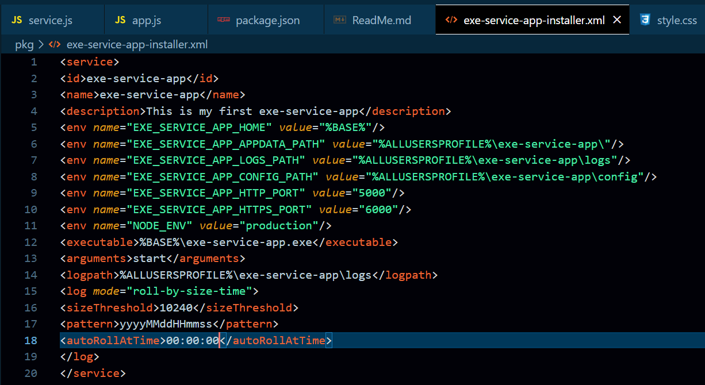
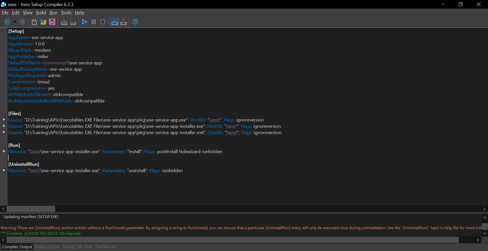
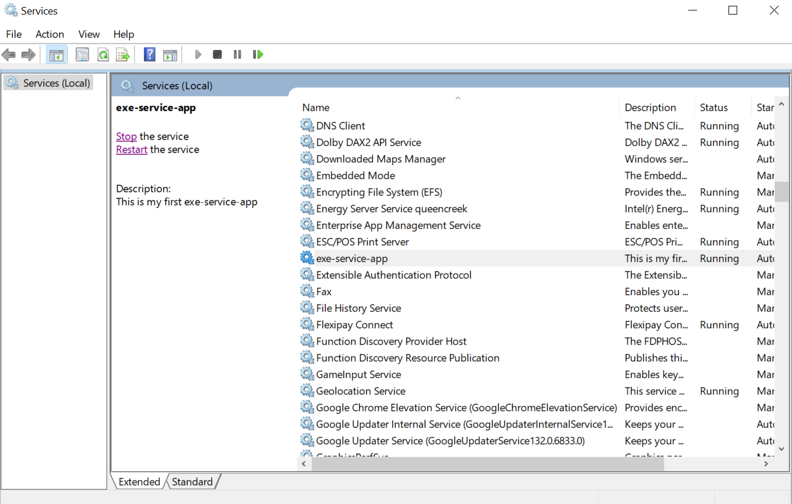

---

# First EXE Service App

This is a simple Express Executable application that sends a basic HTML response when accessed via the root route (`/`).

## Prerequisites

Before getting started, ensure you have the following installed on your machine:

- **Node.js**: Version 14 or higher (download it from [here](https://nodejs.org/))
- **npm**: Node's package manager (comes with Node.js)

## Getting Started

Follow these steps to create and run the project locally:

### 1. Create a New Project

1. Create a new directory for your project:
    ```bash
    mkdir first-express-app
    cd first-express-app
    ```

2. Initialize a new Node.js project:
    ```bash
    npm init -y
    ```

    This will generate a `package.json` file that includes basic project information.

### 2. Install Express

Install Express, a web framework for Node.js, as a dependency:

```bash
npm install express
```

### 3. Run Your Application

To run the application, follow these steps:

1. Open a terminal or command prompt.
2. Navigate to the project directory:
    ```bash
    cd path/to/first-express-app
    ```

3. Start the server:
    ```bash
    node app.js
    ```

4. Open your browser and go to `http://localhost:5000` to see the page.

### 4. Create EXE File (Windows Executable)

**Note:** If you're using Node.js 19 or higher, consider downgrading your Node.js version to 18 or below for compatibility.

1. Install `pkg`, a tool to create executables from Node.js apps:

    ```bash
    npm install -g pkg
    ```

2. Build the executable for all platforms (Windows, Linux, and MacOS):

    ```bash
    pkg app.js
    ```

3. To specify an output directory for your `.exe` file, use the following command:

    ```bash
    pkg . --output .\folder-name\app-name.exe 
    ```

4. To build the `.exe` for Windows only and name the app `AppName.exe`:

    ```bash
    pkg app.js --targets win --output AppName.exe
    ```

### 5. Installing Your App as a Service (Windows Service)

This allows your app to run as a service in the background, even if the editor is closed.

1. Download the [Windows Service Wrapper (WinSW)](https://github.com/winsw/winsw/releases) and copy the downloaded `.exe` to a folder for your project.

2. Create a folder for configurations and give it a name related to your project, e.g., `exe-service-app`.

3. Create a `.xml` configuration file (e.g., `exe-service-app.xml`) to install your `.exe` app as a Windows service. Below is an example configuration:

    ```xml
    <service>
      <id>exe-service-app</id>
      <name>exe-service-app</name>
      <description>This is my first exe-service-app</description>
      <env name="EXE_SERVICE_APP_HOME" value="%BASE%"/>
      <env name="EXE_SERVICE_APP_APPDATA_PATH" value="%ALLUSERSPROFILE%\exe-service-app\"/>
      <env name="EXE_SERVICE_APP_LOGS_PATH" value="%ALLUSERSPROFILE%\exe-service-app\logs"/>
      <env name="EXE_SERVICE_APP_CONFIG_PATH" value="%ALLUSERSPROFILE%\exe-service-app\config"/>
      <env name="EXE_SERVICE_APP_HTTP_PORT" value="5000"/>
      <env name="EXE_SERVICE_APP_HTTPS_PORT" value="6000"/>
      <env name="NODE_ENV" value="production"/>
      <executable>%BASE%\exe-service-app.exe</executable>
      <arguments>start</arguments>
      <logpath>%ALLUSERSPROFILE%\exe-service-app\logs</logpath>
      <log mode="roll-by-size-time">
        <sizeThreshold>10240</sizeThreshold>
        <pattern>yyyyMMddHHmmss</pattern>
        <autoRollAtTime>00:00:00</autoRollAtTime>
      </log>
    </service>
    ```


    > Log files will be stored in the `ProgramData` folder.

4. Install [Inno Setup](https://jrsoftware.org/isinfo.php) and create an installer for your app using the following script. Save this script as `installer.iss`:

    ```ini
    [Setup]
    AppName=exe-service-app
    AppVersion=1.0.0
    WizardStyle=modern
    AppPublisher=mike
    DefaultDirName={commonpf}\exe-service-app
    DefaultGroupName=exe-service-app
    PrivilegesRequired=admin
    Compression=lzma2
    SolidCompression=yes
    ArchitecturesAllowed=x64compatible
    ArchitecturesInstallIn64BitMode=x64compatible

    [Files]
    Source: "D:\Training\APIs\Executables EXE Files\exe-service-app\pkg\exe-service-app.exe"; DestDir: "{app}"; Flags: ignoreversion
    Source: "D:\Training\APIs\Executables EXE Files\exe-service-app\pkg\exe-service-app-installer.exe"; DestDir: "{app}"; Flags: ignoreversion
    Source: "D:\Training\APIs\Executables EXE Files\exe-service-app\pkg\exe-service-app-installer.xml"; DestDir: "{app}"; Flags: ignoreversion

    [Run]
    Filename: "{app}\exe-service-app-installer.exe"; Parameters: "install"; Flags: postinstall hidewizard runhidden

    [UninstallRun]
    Filename: "{app}\exe-service-app-installer.exe"; Parameters: "uninstall"; Flags: runhidden
    ```

5. Compile the script using Inno Setup and generate an installer `.exe`.


6. Run the generated installer `.exe` to install your app as a service on Windows.

---
